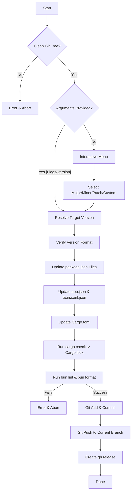

# Specification: Interactive Monorepo Release Script

Design document for the automated release script that synchronizes versions across all monorepo packages, runs formatting and validation checks, commits and pushes to GitHub, and publishes a new release.

## 1. Objectives

- **Consistent Monorepo Versioning**: Synchronize versions across root, server, mobile, Expo, and Tauri packages.
- **Flexible Bumping Options**: Support both command-line arguments (for CLI usage) and a interactive selection menu.
- **Robust Verification**: Run lints and formatting checks on modified files before committing.
- **GitHub Release Integration**: Automate the push and release creation using `gh release` to trigger CI build workflows.

---

## 2. Scope & Target Files

The script will update the version string `X.Y.Z` in the following files:

1. **`package.json`** (Root package version)
2. **`apps/server/package.json`** (Server package version)
3. **`apps/mobile/package.json`** (Mobile package version)
4. **`apps/mobile/app.json`** (Expo version property: `.expo.version`)
5. **`apps/mobile/src-tauri/tauri.conf.json`** (Tauri package version: `.version`)
6. **`apps/mobile/src-tauri/Cargo.toml`** (Rust Cargo package version: `[package] version`)
7. **`apps/mobile/src-tauri/Cargo.lock`** (Rust Cargo lockfile - regenerated via `cargo check`)

---

## 3. Workflow Design



### 3.1. Phase 1: Pre-checks
Before prompting or modifying files, the script checks:
- **Clean Git Status**: Uses `git diff-index --quiet HEAD --` to verify the working directory is clean. If dirty, prints an error message and exits with status 1.
- **Active Branch**: Determines the current branch using `git branch --show-current`.

### 3.2. Phase 2: Version Resolution
The current version is parsed from `apps/mobile/package.json` using `jq -r .version`.

If run with flags:
- `--patch`: Increments the patch number (e.g., `1.10.2` -> `1.10.3`).
- `--minor`: Increments the minor number and resets patch to 0 (e.g., `1.10.2` -> `1.11.0`).
- `--major`: Increments the major number and resets minor/patch to 0 (e.g., `1.10.2` -> `2.0.0`).
- A raw SemVer string (e.g., `1.10.3` or `v1.10.3`): Normalizes by removing the leading `v` if present.

If run without arguments:
- Display current version.
- Prompts using a numbered menu:
  1. Patch (`X.Y.Z+1`)
  2. Minor (`X.Y+1.0`)
  3. Major (`X+1.0.0`)
  4. Custom (prompts for manual version string)

### 3.3. Phase 3: Synchronized Bumping
For the calculated/provided `$VERSION`:

1. **JSON Files**:
   - `jq --arg v "$VERSION" '.version = $v' <file> > <file>.tmp && mv <file>.tmp <file>` for the root `package.json`, `apps/server/package.json`, `apps/mobile/package.json`, and `apps/mobile/src-tauri/tauri.conf.json`.
   - `jq --arg v "$VERSION" '.expo.version = $v' apps/mobile/app.json > apps/mobile/app.json.tmp && mv apps/mobile/app.json.tmp apps/mobile/app.json` for `apps/mobile/app.json`.
2. **Cargo.toml**:
   - `sed -i -E 's/^version = "[^"]*"/version = "'"$VERSION"'"/' apps/mobile/src-tauri/Cargo.toml`
3. **Cargo.lock**:
   - Run `cargo check --manifest-path apps/mobile/src-tauri/Cargo.toml` to regenerate the lockfile cleanly.

### 3.4. Phase 4: Validation
- Runs `bun lint` to check for static analysis issues.
- Runs `bun format` to clean up formatting.
- If either command exits with a non-zero status, the script stops and outputs a failure message.

### 3.5. Phase 5: Git & GitHub Release
- Stages the changed files:
  ```bash
  git add package.json apps/server/package.json apps/mobile/package.json apps/mobile/app.json apps/mobile/src-tauri/tauri.conf.json apps/mobile/src-tauri/Cargo.toml apps/mobile/src-tauri/Cargo.lock
  ```
- Commits changes:
  ```bash
  git commit -m "release: v$VERSION"
  ```
- Pushes the branch:
  ```bash
  git push origin "$BRANCH"
  ```
- Creates GitHub release:
  ```bash
  gh release create "v$VERSION" --generate-notes
  ```

---

## 4. Error Handling & Edge Cases

- **Invalid SemVer Inputs**: The script validates that the resolved version matches the regex `^[0-9]+\.[0-9]+\.[0-9]+$` before updating any files.
- **Dependency Missing**: Checks that `jq`, `cargo`, and `gh` are available in the system path. If any are missing, it outputs a diagnostic message and exits.
- **GitHub Auth**: If the user is not authenticated with the GitHub CLI, `gh release` might fail. The script will alert the user beforehand, or gracefully warn them if the push succeeds but the release creation fails.
